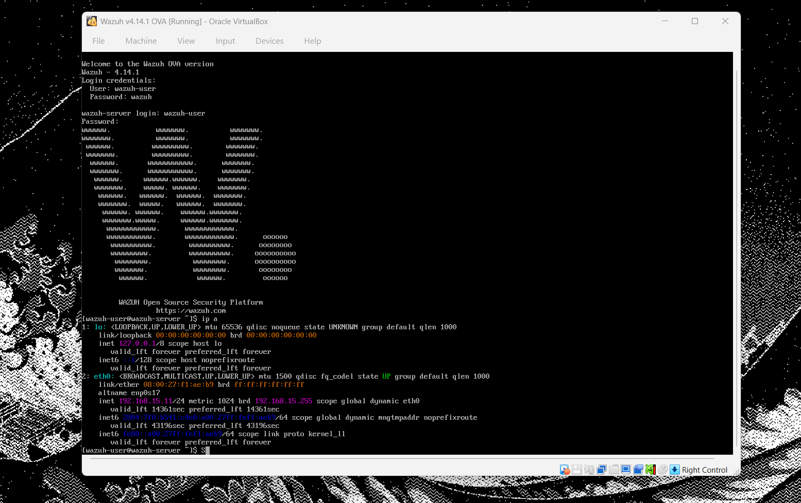
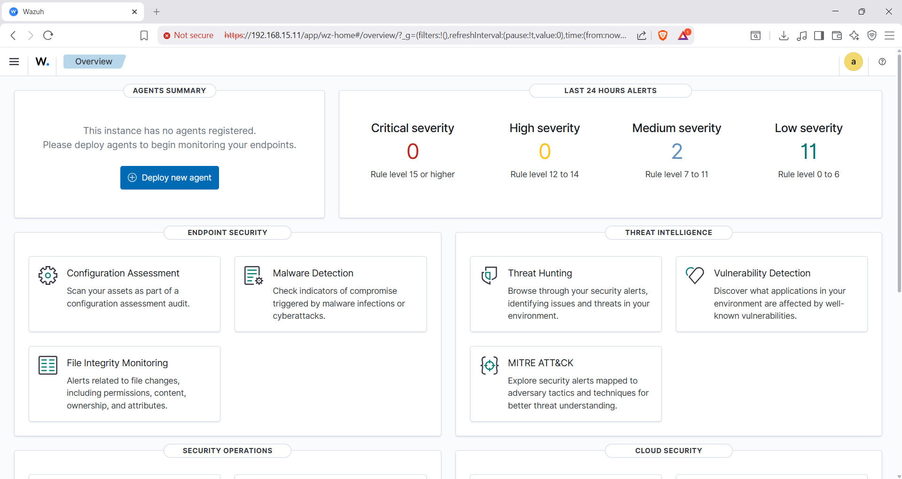
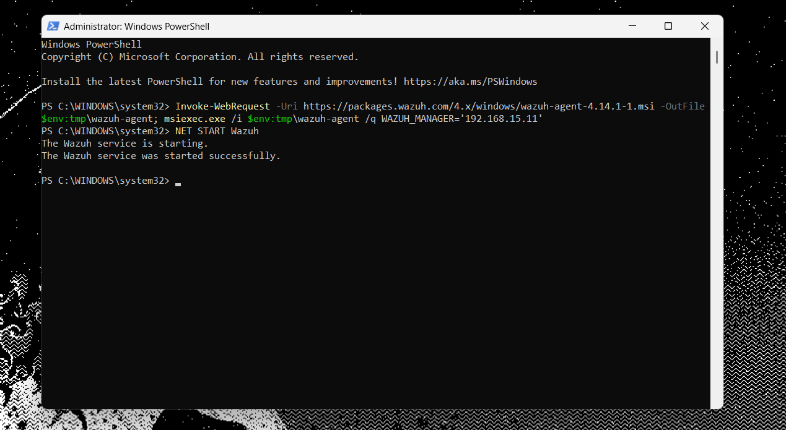
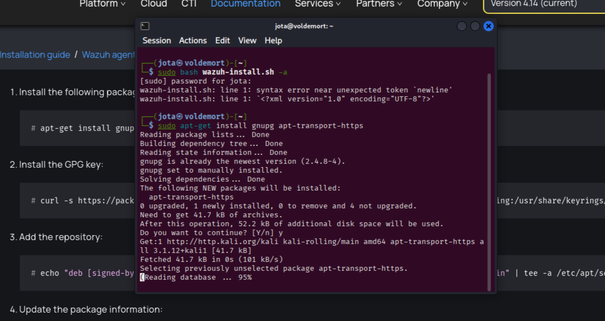
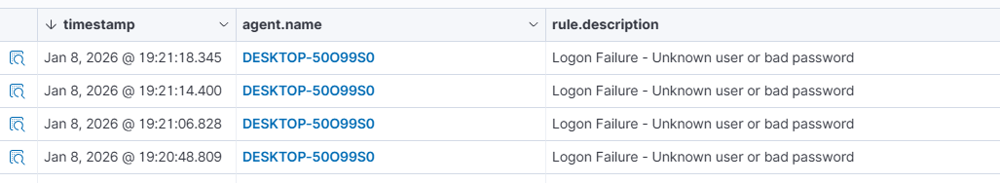

# Wazuh SIEM – Implantação em Home Lab

Este repositório documenta o processo completo de **instalação, configuração e testes do Wazuh SIEM** em um ambiente de **Home Lab**, utilizando a **OVA oficial do Wazuh**, agentes em **Windows e Kali Linux**, e validação através de eventos reais e alertas de segurança.

O objetivo deste projeto é **aprendizado prático em Blue Team / SOC**, monitoramento de endpoints e análise de eventos de segurança.

---

## 🧠 Arquitetura do Ambiente

- **Wazuh Server**
  - Implantado via **OVA (VirtualBox)**
  - Versão: **Wazuh 4.14.1**
- **Endpoints monitorados**
  - Windows (Laptop)
  - Kali Linux
- **Acesso ao Dashboard**
  - A partir de um desktop na mesma rede
- **Rede**
  - Ambiente local (192.168.15.0/24)

---

## 🛠️ Tecnologias Utilizadas

- Wazuh SIEM
- VirtualBox
- Kali Linux
- Windows 10/11
- Wazuh Agent
- Elastic Stack (integrado ao Wazuh)

---

## 🚀 Etapas do Projeto

### 1️⃣ Implantação do Wazuh via OVA
- Importação da OVA oficial no VirtualBox
- Inicialização da VM
- Validação de conectividade de rede
- Acesso ao dashboard web



---

### 2️⃣ Acesso ao Dashboard Wazuh
- Login no dashboard via navegador
- Verificação do status inicial (sem agentes registrados)



---

### 3️⃣ Instalação do Agente no Windows
- Download do agente
- Registro do agente no Wazuh Server
- Validação da comunicação



---

### 4️⃣ Instalação do Agente no Kali Linux
- Adição do repositório oficial
- Instalação do wazuh-agent
- Registro no manager
- Inicialização do serviço



---

### 5️⃣ Testes e Geração de Alertas
Foram realizados testes práticos para validação do SIEM, incluindo:

- Tentativas de login inválidas (Authentication Failure)
- Eventos de segurança no Windows
- Avaliações de configuração (CIS Benchmark)
- Monitoramento de eventos em tempo real



---

## 📊 Resultados Observados

- Alertas de falha de autenticação detectados
- Eventos classificados por severidade
- Logs centralizados no dashboard
- Funcionamento correto dos agentes Linux e Windows

---

## 🎯 Objetivo do Projeto

- Prática com SIEM em ambiente realista
- Aprendizado em monitoramento de endpoints
- Análise de eventos de segurança
- Base para estudos em SOC / Blue Team

---

## 📌 Próximos Passos

- Implementar File Integrity Monitoring (FIM)
- Testes de detecção de malware
- Integração com MITRE ATT&CK
- Simulação de ataques controlados

---

## 📷 Evidências

As imagens do processo estão disponíveis na pasta:

```bash
/screenshots
